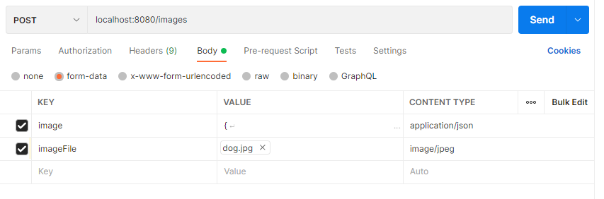
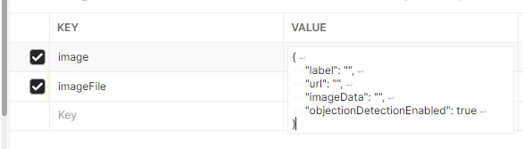

# imageRecognition
Spring Service to Interface with Images and have them processed for recognized Objects

- Dockerfile : served to create an image which will run the spring application within a container
- docker-compose : used to set up the local environment and run the full application e2e with all dependcies

### Requirements
Make sure you meet all of the following requirements
* You have [Java](https://www.java.com/en/download/manual.jsp) Installed on your PC
* You Have [Docker](https://www.docker.com/products/docker-desktop/) installed with Daemon Running Succesfully
* Read the 'Options' sections for details on runnning the app outside of docker. 

### Get Started!
####- Setup - 
First let's get the environment set up and Everything running locally. Execute the following Commands in Order in your terminal. 
1. Run maven install in the project root directory
> mvn clean install
2. Run Docker-Compose to start the ImageRecoginition App & Postgres Containers ([Docker Compose File](docker-compose.yml))
> docker-compose up -d
####- Use -
The App should be running successfully at this point. Now let's interact with it.
* Visit the [Swagger](http://localhost:8080/swagger-ui.html) and execute some of the Endpoins there
* Refer to the [Project Definition](src/main/resources/static/readmeImages/CodingExerciseRequirements.pdf) for additional understanding of the endpoints
* <b>Important! -</b> Regarding the POST - /images method. This will not work via Swagger. You must use an application, such as PostMan, to execute it properly if uploading an Image.
  Refer to the below example on how to properly execute and test this method if uploading a file. <u>If you wish to use a URL</u> simply add the URL of the image to the JSON property in the JSON of the image Key (Which is empty in the 2nd screenshot). 

### Options 
* If you want to run the App locally, <b>NOT</b> on docker, make sure your active profile is set to 'local'. This is to ensure the postgres url is pointing to local port and not to dockker Container
* If you'd like to spin up a single Postgres container for testing locally, to debug, or run the app in your ide; run the following command in your
terminal: 
> docker run --name postgresqldb -p5432:5432 -e POSTGRES_USER=postgres -e POSTGRES_PASSWORD=postgres -e POSTGRES_DB=imagedb postgres
